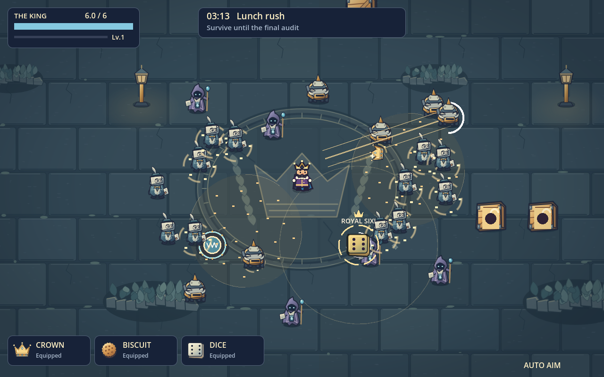
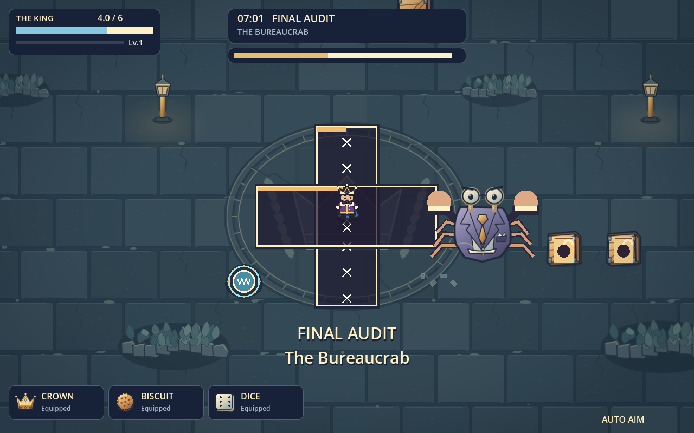

# Midnight Audit visual and audio pass

Based on the latest presentation branch, commit `edd5c66` / PR #16. This branch contains that work and its earlier unmerged gameplay and performance changes. It targets `feat/combat-presentation`; checking out PR #17 gives the complete build.

## What changed

- Replaced the bright, flat grass field with a slate courtyard: engraved crown medallions, restrained stone texture, lanterns, worn planting beds, scattered paperwork and a subtle vignette.
- Gave the three regular enemy roles original illustrated silhouettes: a paper clerk, charging stapler and ink caster. Added transform animation, material shading and paper death debris. Bureaucrab has a new tailored body and spectacles while retaining independently animated stamping claws and legs.
- Illustrated brass crowns, toasted biscuits and bevelled ivory dice, with matching equipment icons. Added layered trails, crisp glints, angular crumbs, paper fragments and expanding blast rings. Preserved actual damage, projectile caps, safe dice rolling, six reveal, warning geometry and timings.
- Composed three original 68.57-second stereo arrangements with bass, plucked strings, keyboard motifs, sustained harmony and percussion. They share 112 BPM and switch with phase-preserving one-bar crossfades. Thirty-two bars and quieter middle sections replace the previous few-second loop.
- Rendered 42 original SFX recordings: metallic crown contact/catch, biscuit cracks, die clacks, bass impacts, springs and signature motifs. Routine materials vary without immediate repeats. Protected damage/signature voices, smooth ducking, compression and a mix limiter keep dense fights controlled. Preferences retain their existing behaviour.

## Review findings and safeguards

The baseline rendered successfully. Its core, weapon, arena and collision suites passed, while a run fixture accidentally counted a separate direct crown hit as part of a dice blast. That fixture now starts the crown between the die and target, preserving a real swept crown-to-die collision while isolating blast damage.

The original loot check counted all children in the scene. Adding paper debris exposed that assumption. It now verifies the enemy is gone and the XP-gem count increases by exactly one, so the duplicate-loot guard remains meaningful.

The first new combat render showed crumb rings competing with actors; they were reduced to quiet interrupted arcs. SVG transparency uses explicit opacity for consistent import. All character silhouettes, six dice faces, boss warning rectangles, dense-hit visibility and equipment cards have rendered fixtures.

Scenery is capped at 125 nodes in a moving 5×5 neighbourhood. Imported art is reused; enemy animation changes transforms at 20 Hz and stops when leaving the screen. Ordinary effects remain capped at 32, bomb effects at 16 and dice effects at 8. No decorative code consumes gameplay RNG. The score/SFX together add about 3.5 MB of compressed audio; generation is offline.

## Reproduce

Use Godot 4.3. Import first, then run `core_loop`, `weapon`, `arena`, `collision_query`, `run`, `polish`, `presentation`, and `midnight` test scripts:

```sh
godot --headless --editor --path thing-riot-v1 --import
godot --headless --path thing-riot-v1 --script res://tests/midnight_test.gd
godot --path thing-riot-v1 --rendering-method gl_compatibility --script res://tests/midnight_visual.gd
```

The GitHub workflow runs the complete gate and stores logs/screenshots in the `godot-qa` artifact. It also compares rendered 180-enemy workloads against the baseline on the same software-rendering runner. These timings are for relative comparison, not promises of Windows FPS.

Regenerate SVG sources with `python tools/build_midnight_art.py` (standard library). Regenerate audio with `python tools/build_midnight_audio.py` (NumPy, SciPy and ffmpeg). Audio contains no third-party samples. `audio-render-report.json` records duration, source peak/RMS, loop boundary measurements and measured loudness of the three encoded arrangements. Measured music is −17.5 / −17.1 / −15.9 LUFS before the in-game mix attenuation, with true peaks below −2.7 dBFS.

## Validation status

Verified on commit `52b032e`, [GitHub Actions run 34379040591](https://github.com/Leonod33/ThingRiot/actions/runs/34379040591): Godot 4.3 import succeeded; **185 checks passed with zero failures** (34 core, 16 weapons, 19 arena, 9 collision, 34 run, 26 polish, 15 presentation, 32 Midnight Audit). All six visual fixtures rendered without script errors: opening, combat, dice faces, crowd damage, boss warnings and upgrade cards.

The same-runner software-OpenGL comparison retained 180 enemies, 3 hostile bolts and 40 royal projectiles in both builds:

| Metric | Previous presentation build | Midnight Audit |
| --- | ---: | ---: |
| Median wall frame | 106.737 ms | 72.659 ms |
| p95 wall frame | 121.715 ms | 89.063 ms |
| Median script tick | 3.199 ms | 3.669 ms |
| p95 script tick | 4.320 ms | 4.894 ms |

Median wall frame time improved about 32%, with a small increase in script cost from added animation. This is a fixed-workload comparison using llvmpipe software rendering, not an expected frame rate on a hardware GPU. The benchmark preserves production behaviour and uses durable enemies only in its isolated fixture.





Human listening on the user's speakers/headphones, physical controller feel and a full eight-minute balance playthrough remain useful final taste/feel checks. No gameplay balance was intentionally changed in this pass.
